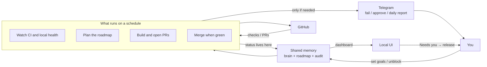

# hermes-ops-kit

**Your coding agent runs a daily engineering ops team — CI, roadmap, PRs, and a “needs you” queue — while you stay mostly offline.**

This kit turns [Hermes Agent](https://hermes-agent.dev) into a scheduled pipeline that:

1. Watches your GitHub CI and opens real autofix PRs  
2. Keeps a product roadmap (agent work vs human work)  
3. Implements agent-owned items and merges green PRs  
4. Texts you on Telegram only when something failed, needs approval, or it’s the end-of-day report  

It is **not** another chatbot. It is **not** a Hermes fork. It’s the ops layer you install on top of Hermes so the agent shows up for work on a clock.

---

## In one sentence

Cron jobs + a shared brain + a local UI + sparse Telegram = an autonomous software ops loop you can actually leave running.

| You get | You don’t get |
|---------|----------------|
| Daily CI → PR → merge loop | Another AI wrapper with no schedule |
| Roadmap with clear human gates | Vague “assistant will figure it out” |
| Audit trail + dashboard on `:8888` | Telegram spam for every successful job |
| Installable templates for your org/repos | Someone else’s products, tokens, or history |

**Requires:** Hermes already installed and gateway running. Then clone this kit, fill `ops-config.yaml`, run `install.py`.

---

## How it works

Once a day (and on a few short intervals), Hermes runs a small set of jobs. They share one memory, ship work to GitHub, and only bother you when something is blocked or broken.



**The loop**

1. **Watch** — CI and local project health get checked; results go into shared memory.  
2. **Plan** — Work is labeled agent-owned or human-owned (with exact steps when it’s you).  
3. **Build** — Agent items become real PRs; red CI can get an autofix PR.  
4. **Merge** — Green safe PRs merge themselves; risky ones wait for your yes.  
5. **You only when needed** — Dashboard for progress; Telegram for failures, approvals, and the daily report.  

Job-level detail: [docs/ARCHITECTURE.md](docs/ARCHITECTURE.md).

---

## What’s in the box

- Scripts: brain bus, audit, CI/PR monitors, roadmap UI, HITL helpers  
- Skills: `brain`, `roadmap`, `dev-test-loop`, `human-approval`, `ops-daily-review`, `auto-pr-fixer`, …  
- Templated cron jobs (sparse Telegram contracts baked in)  
- Empty brain + roadmap starters  
- `install/install.py` + `install/doctor.py`  

**Not shipped:** live brain content, cron history, tokens, or product-specific secrets.

---

## Prerequisites

1. Hermes Agent (`hermes` on PATH) + gateway running  
2. Auth for the models in your config (`hermes auth list`)  
3. `gh` authenticated — prefer `HERMES_GH_TOKEN` bot ([docs/GITHUB_SERVICE_ACCOUNT.md](docs/GITHUB_SERVICE_ACCOUNT.md))  
4. Python 3.11+  
5. Optional: `pip install pyyaml` (YAML config; JSON works without it)  

---

## 10-minute setup

```bash
git clone https://github.com/jtk4545/hermes-ops-kit.git
cd hermes-ops-kit

cp config.example.yaml ops-config.yaml
# edit: org, repos, projects_root, models, timezone

python install/install.py --config ops-config.yaml
# review $HERMES_HOME/cron/generated/CREATE_JOBS.md
# then hermes cron create … per job

python install/doctor.py
python "$HERMES_HOME/scripts/server.py"   # http://127.0.0.1:8888/
```

Windows default `HERMES_HOME`: `%LOCALAPPDATA%\hermes`.

**Turn jobs on in layers:** scripts first (sentinel, PR monitor, UI, audit, human queue) → PM + market → CI autofix + executor.

---

## Configuration

[config.example.yaml](config.example.yaml)

| Key | Purpose |
|-----|---------|
| `github.org` / `github.repos` | CI scan + PR monitor targets |
| `products` | Roadmap / UI product keys |
| `projects` | Local sentinel health checks |
| `timezone` | Weekend HITL defer |
| `models.*` | Provider/model IDs for agent jobs |

Env: `HERMES_HOME`, `HERMES_BRAIN_DIR`, `HERMES_PROJECTS_ROOT`, `HERMES_OPS_CONFIG`, `HERMES_GH_TOKEN`, `HERMES_OPS_TIMEZONE`.

---

## Telegram policy

Only three kinds of messages:

1. Failures / needs attention  
2. Human ACTION / APPROVAL (weekdays)  
3. Daily ops report  

Everything else → `[SILENT]` / empty stdout → audit + UI.

---

## Docs

- [docs/ARCHITECTURE.md](docs/ARCHITECTURE.md) — diagrams + control planes  
- [docs/OPS_DESIGN.md](docs/OPS_DESIGN.md) — design SoT  
- [docs/OPS_MODELS.md](docs/OPS_MODELS.md) — model routing  
- [docs/GITHUB_SERVICE_ACCOUNT.md](docs/GITHUB_SERVICE_ACCOUNT.md) — bot token  

## Layout

```text
hermes-ops-kit/
  config.example.yaml
  scripts/
  skills/
  templates/brain/
  templates/roadmaps.json
  templates/cron/jobs.template.json
  install/
  docs/
```

## License

MIT — see [LICENSE](LICENSE).
