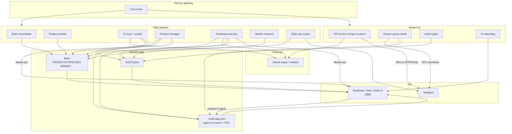

# hermes-ops-kit

Reusable **multi-job ops stack** for [Hermes Agent](https://hermes-agent.dev): shared brain, roadmap UI, audit control plane, CI autofix, merge-on-green, HITL queue, and a daily ops review.

This is an **ops layer on top of Hermes** — not a Hermes fork. You need the `hermes` CLI + gateway already working (Telegram deliver optional but recommended).

## What you get

- Portable scripts (`brain_*`, `ops_audit`, CI/PR monitors, roadmap UI, HITL helpers)
- Ops skills (`brain`, `roadmap`, `dev-test-loop`, `human-approval`, `ops-daily-review`, …)
- Templated cron jobs with sparse-Telegram contracts
- Empty brain + roadmap starters
- `install.py` + `doctor.py`

**Not included:** your live brain content, cron history, tokens, or product-specific secrets.

## How it works

Hermes Agent’s **gateway** runs a cron ticker. This kit installs scripts, skills, and job templates into `$HERMES_HOME`. Each day those jobs read/write a shared **brain** and **roadmap**, record everything in an **audit** log, and only ping **Telegram** for failures, human-in-the-loop gates, or the evening ops report. Progress otherwise stays in the local UI (`:8888`).



**Loop in plain language**

1. **Sense** — Sentinel and CI scan check local projects and GitHub Actions; results land in the brain / audit.
2. **Plan** — The PM cron classifies roadmap work as `owner=agent` or `owner=human`, with exact HITL steps when you must act.
3. **Ship** — The executor runs a timeboxed dev-test loop on agent items, opens `hermes-exec` PRs, and enables auto-merge when safe. Autofix does the same for red CI (`hermes-autofix`).
4. **Merge** — PR monitor merges green labeled PRs; approval holds wait for your `yes` (weekdays).
5. **Unblock** — Blocked items show in the UI **Needs you** panel; releasing them returns ownership to the agent. Human-queue watch reminds on Telegram with backoff.
6. **Review** — Evening digest + ops review grades the day from the audit scorecard and always sends the daily Telegram report.

Sparse Telegram: routine success is `[SILENT]` (or empty script stdout). Detail lives in audit + UI. More detail: [docs/ARCHITECTURE.md](docs/ARCHITECTURE.md).

## Prerequisites

1. Hermes Agent installed (`hermes` on PATH)
2. Gateway running (`hermes gateway` / `hermes cron status`)
3. Auth for the models you configure (`hermes auth list`)
4. GitHub CLI (`gh`) authenticated — prefer `HERMES_GH_TOKEN` bot (see [docs/GITHUB_SERVICE_ACCOUNT.md](docs/GITHUB_SERVICE_ACCOUNT.md))
5. Python 3.11+
6. Optional: `pip install pyyaml` (for YAML config; JSON also works)

## 10-minute setup

```bash
git clone <this-repo> hermes-ops-kit
cd hermes-ops-kit

# 1) Configure
cp config.example.yaml ops-config.yaml
# edit ops-config.yaml — org, repos, projects_root, models, timezone

# 2) Install into HERMES_HOME + ~/.hermes
python install/install.py --config ops-config.yaml

# 3) Create cron jobs (review first — never silent-overwrite)
#    Guide written to: $HERMES_HOME/cron/generated/CREATE_JOBS.md
#    Use `hermes cron create ...` per job, or import carefully.

# 4) Doctor
python install/doctor.py

# 5) UI
python "$HERMES_HOME/scripts/server.py"
# → http://127.0.0.1:8888/
```

On Windows, `%LOCALAPPDATA%\hermes` is the default `HERMES_HOME`.

### Enable jobs gradually

1. Script jobs first: consolidate, sentinel, PR monitor, UI watchdog, audit ingest, human queue  
2. Then PM + market  
3. Then CI autofix + executor  

## Configuration

See [config.example.yaml](config.example.yaml).

| Key | Purpose |
|-----|---------|
| `github.org` / `github.repos` | CI scan + PR monitor targets |
| `products` | Roadmap / UI product keys |
| `projects` | Local sentinel health checks |
| `timezone` | Weekend HITL defer + schedules mental model |
| `models.*` | Provider/model IDs for agent jobs |

Env knobs: `HERMES_HOME`, `HERMES_BRAIN_DIR`, `HERMES_PROJECTS_ROOT`, `HERMES_OPS_CONFIG`, `HERMES_GH_TOKEN`, `HERMES_OPS_TIMEZONE`.

## Docs

- [docs/ARCHITECTURE.md](docs/ARCHITECTURE.md) — day pipeline + control planes  
- [docs/OPS_DESIGN.md](docs/OPS_DESIGN.md) — design SoT  
- [docs/OPS_MODELS.md](docs/OPS_MODELS.md) — model routing  
- [docs/GITHUB_SERVICE_ACCOUNT.md](docs/GITHUB_SERVICE_ACCOUNT.md) — bot token  

## Telegram policy

Only:

1. **Failures** / needs attention  
2. **HITL** ACTION/APPROVAL (weekdays)  
3. **Daily ops report**  

Routine success → `[SILENT]` / empty stdout → audit + UI.

## Layout

```text
hermes-ops-kit/
  config.example.yaml
  scripts/                 # portable Python + HTML UI
  skills/                  # ops skills only
  templates/brain/         # empty brain starters
  templates/roadmaps.json
  templates/cron/jobs.template.json
  install/{install,render_jobs,doctor}.py
  docs/
```

## License

MIT — see [LICENSE](LICENSE).
