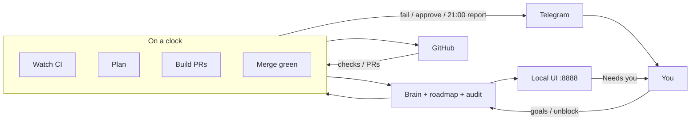

# hermes-ops-kit

Your coding agent already writes patches. This kit gives it a **shift**: cron jobs, a shared memory, a local dashboard, and a Telegram that only fires when a human actually has to do something.

Install it on top of [Hermes Agent](https://hermes-agent.dev). It is not a fork and not another chat wrapper.

## System map


```mermaid
flowchart LR
  You[You] -->|goals / unblock| Memory["Brain + roadmap + audit"]
  Memory --> Loop
  subgraph Loop [On a clock]
    Watch[Watch CI]
    Plan[Plan]
    Build[Build PRs]
    Merge[Merge green]
  end
  Loop --> GitHub[GitHub]
  GitHub -->|checks / PRs| Loop
  Loop --> Memory
  Memory --> UI[Local UI :8888]
  Loop -->|fail / approve / 21:00 report| Ping[Telegram]
  Ping --> You
  UI -->|Needs you| You
```

You set goals and clear **Needs you**. The clock watches CI, plans the roadmap, opens PRs, and merges green ones. Status lives in the brain and on `:8888`. Telegram only fires for failures, approvals, and the daily report.

Job-level diagrams: [docs/ARCHITECTURE.md](docs/ARCHITECTURE.md).

---

## What you walk away with

| While you are gone | When you get back |
|--------------------|-------------------|
| CI watched; autofix PRs opened on red checks | Green `hermes-exec` / `hermes-autofix` PRs already merging |
| Agent-owned roadmap items implemented against tests | Dashboard on `:8888` shows what moved |
| Failures, approvals, and the 21:00 report on Telegram | A **Needs you** list with exact steps — not a wall of logs |

You still own secrets, prod consoles, and anything labeled `owner=human`. The agent does not force-push `main` and does not spam you for successful jobs.

---

## 10-minute setup

Requires: Hermes on PATH, gateway running, Python 3.11+, `gh` auth. Coding jobs also need `hermes auth add xai-oauth` (and usually `openai-codex`).

```bash
git clone https://github.com/jtk4545/hermes-ops-kit.git
cd hermes-ops-kit

cp config.example.yaml ops-config.yaml
# edit four things: github.org, github.repos, products, timezone
# then models.* if your provider IDs differ

python install/install.py --config ops-config.yaml
python install/doctor.py
python "$HERMES_HOME/scripts/server.py"   # http://127.0.0.1:8888/
```

`install.py` copies scripts/skills, seeds an empty brain, and writes `$HERMES_HOME/cron/generated/CREATE_JOBS.md`. It **does not** overwrite your live `cron/jobs.json`. You create jobs from that guide, in layers:

1. Scripts (`no_agent`): sentinel, PR monitor, UI watchdog, audit, human queue
2. PM + market + daily report
3. CI autofix + day executor
4. Optional: night executor, UI-live, GCP scan

**`HERMES_HOME` defaults**

| OS | Default |
|----|---------|
| Windows | `%LOCALAPPDATA%\hermes` |
| Linux / macOS | `$XDG_DATA_HOME/hermes` or `~/.local/share/hermes` |

Interactive mirrors and `roadmaps.json` live under `~/.hermes`. Prefer forward-slash paths in prompts (`$HERMES_HOME/scripts/...`).

Open **http://127.0.0.1:8888/checkin** after the UI starts. If that page loads, install worked.

---

## A weekday, in plain terms

```text
09:00–17:00  Day executor picks agent-owned roadmap items, opens PRs (20–30m slices)
09:30 / 15:30  CI scan. Red checks → autofix PR, or one amend on an open Hermes PR
all day      PR monitor merges green labeled PRs; Telegram only Mon–Fri 09:00–17:00
18:00        Market notes land in the brain (no code)
21:00        Daily report on Telegram; optional UI-live scan
00:00–04:00  Night executor, local only — nothing hits Telegram
```

Weekend: jobs still run. New ACTION/APPROVAL pings wait until Monday.

---

## Dashboard map

| URL | What it is |
|-----|------------|
| http://127.0.0.1:8888/ | Roadmap |
| http://127.0.0.1:8888/checkin | Hermes PRs + **Needs you** |
| http://127.0.0.1:8888/jobs | Schedule / last run |
| http://127.0.0.1:8888/audit | What ran, what blocked |
| http://127.0.0.1:8888/instances | Environments (optional) |

Telegram policy is the same three buckets as the table at the top: failure, human ACTION/APPROVAL (weekdays), daily report. Everything else is `[SILENT]` / empty stdout → audit + UI.

---

## Configure

Start from [config.example.yaml](config.example.yaml).

| Key | Why it matters |
|-----|----------------|
| `github.org` / `github.repos` | CI scan + PR monitor targets |
| `products` | Roadmap / UI keys |
| `projects` | Local sentinel health checks |
| `timezone` | Weekend HITL defer + notify window |
| `models.*` | Provider/model IDs for agent jobs |
| `features.*` | Night executor, UI-live, GCP scan, check-in |

Env: `HERMES_HOME`, `HERMES_BRAIN_DIR`, `HERMES_PROJECTS_ROOT`, `HERMES_OPS_CONFIG`, `HERMES_GH_TOKEN`, `HERMES_OPS_TIMEZONE`.

Cheap PM/market model over SSH: [docs/REMOTE_QWEN_GPU.md](docs/REMOTE_QWEN_GPU.md). GitHub bot token: [docs/GITHUB_SERVICE_ACCOUNT.md](docs/GITHUB_SERVICE_ACCOUNT.md).

**Not shipped:** live brain content, cron history, tokens, product secrets.

---

## What's in the tree

```text
hermes-ops-kit/
  config.example.yaml      # copy → ops-config.yaml
  install/install.py       # copy scripts/skills, seed brain, render jobs
  install/doctor.py        # preflight
  scripts/                 # brain, audit, CI/PR, roadmap UI
  skills/                  # brain, roadmap, HITL, autofix, …
  templates/brain/         # empty starters
  templates/cron/          # job contracts
  docs/                    # design + architecture
```

More: [docs/OPS_DESIGN.md](docs/OPS_DESIGN.md) · [docs/OPS_MODELS.md](docs/OPS_MODELS.md) · [docs/ARCHITECTURE.md](docs/ARCHITECTURE.md)

## License

MIT — see [LICENSE](LICENSE).
