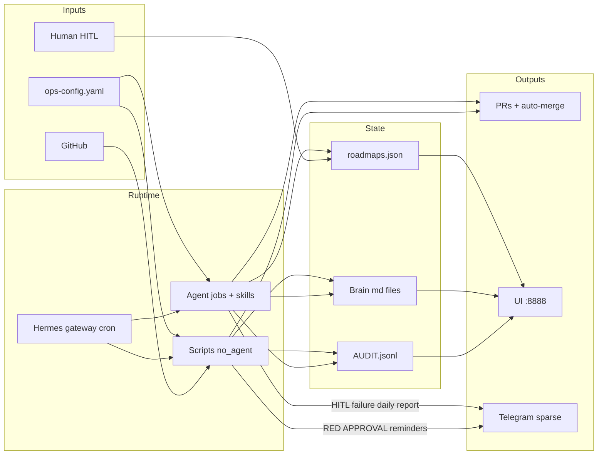
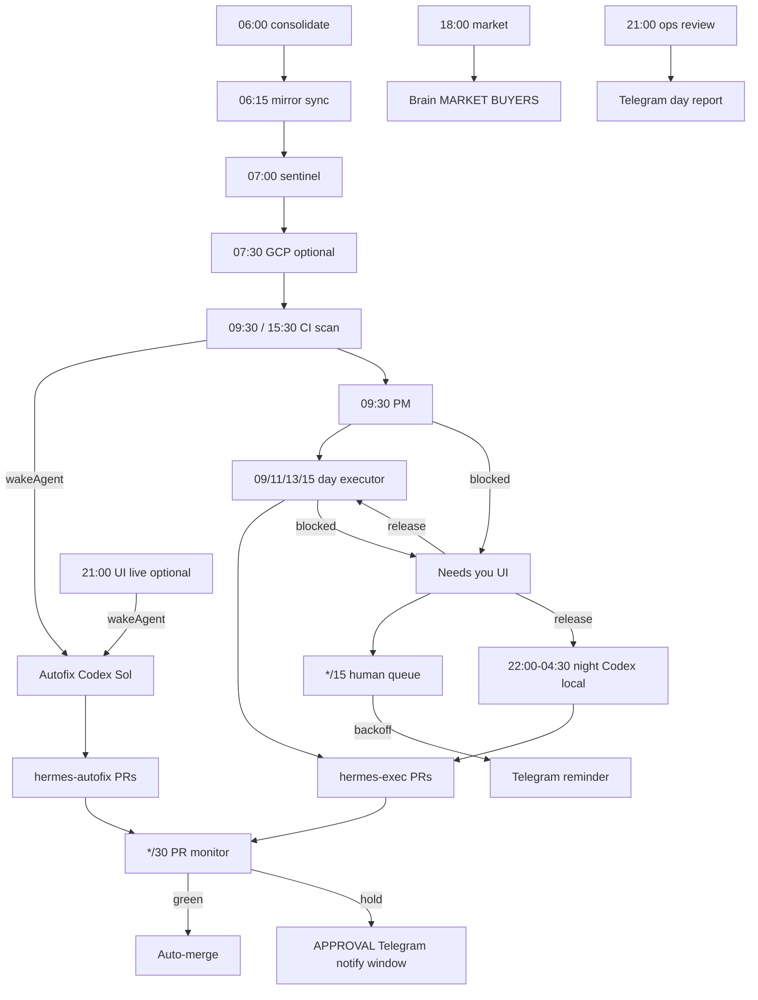
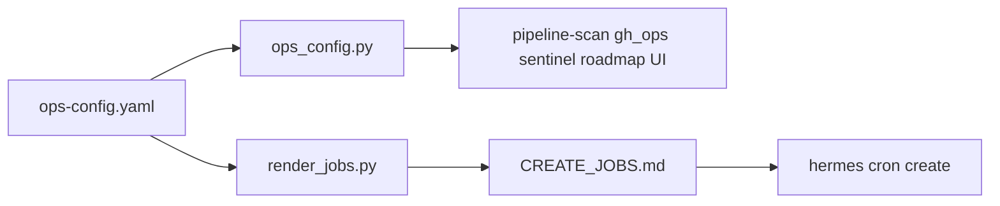

# Hermes Ops Kit — Architecture

This kit is an **ops layer on top of Hermes Agent**. It does not replace Hermes; it adds a shared brain, roadmap UI, audit control plane, and a multi-job daily pipeline.

## System overview



**Read this left → right:** config and GitHub feed script/agent jobs driven by the Hermes gateway. Jobs mutate brain/roadmap/audit. Humans clear HITL via the UI (and optional `/checkin`). Telegram stays quiet except failures, approvals (notify window), and the daily report.

## Day pipeline

```text
06:00  Brain consolidate
06:15  Sync HERMES_HOME ↔ ~/.hermes mirrors
07:00  Project sentinel (local health → PIPELINES)
07:30  GCP ops scan (optional)
09:30  CI scan (+ autofix agent if wakeAgent)   …also 15:30
09:30  Product manager (roadmap classify)
09:00  Roadmap executor (day Grok)              …also 11:00, 13:00, 15:00
22:00  Night executor (Codex, local)            …every 30m through 04:30
*/15   Human queue watch (Telegram backoff; quiet weekends)
*/30   PR monitor (merge-on-green 24/7; Telegram Mon–Fri notify_window)
*/10   Audit ingest (backfill agent outputs)
*/5    Roadmap UI watchdog (:8888)
18:00  Market research → MARKET / BUYERS
21:00  Daily ops review + Telegram day report
21:00  UI live scan (optional; + autofix if wakeAgent)
```



## Control planes

| Plane | SoT | Purpose |
|-------|-----|---------|
| Brain | `$HERMES_HOME/brain/*.md` | Product intent, market, decisions, quality bars |
| Roadmap | `~/.hermes/roadmaps.json` | Agent vs human work queue + HITL steps |
| Audit | `brain/AUDIT.jsonl` | What ran, what blocked, PR/repo links |
| Cron | `$HERMES_HOME/cron/jobs.json` | Schedules, models, prompts (live; not shipped) |
| Config | `ops-config.yaml` | Org, repos, timezone, models, features, local checks |

## Job kinds

- **Script / `no_agent`:** stdout delivered when non-empty (silent = empty). Examples: sentinel, PR monitor, UI watchdog, audit ingest, optional GCP scan.
- **Script + agent:** script prints context / `{"wakeAgent": true|false}`; agent runs only when needed (CI / UI live autofix) or always (daily digest).
- **Agent:** LLM with skills; final response must be exactly `[SILENT]` unless HITL, failure, or daily report.
- **Night executor special:** agent with `deliver=local` and empty fallback — never Telegram.

## Sparse Telegram

Deliver only:

1. Failures / needs attention (Mon–Fri notify_window; configurable)
2. Human ACTION / APPROVAL packets (weekdays, notify_window)
3. Daily ops report (`f6ops2100`, always)

Everything else → audit + UI. Night executor never delivers Telegram.

## Dual-quota hard stop

Coding path uses Grok and/or Codex Sol only. When **both** are exhausted: stop coding crons, audit `QUOTA:`, one short weekday Telegram line. Do not thrash on Copilot/Bonsai.

## Optional advanced topology

| Feature flag | Job | Requires |
|--------------|-----|----------|
| `features.night_executor` | `d4execnight` | Codex auth; keep `deliver=local` |
| `features.ui_live` | `h11uilive23` | `ui-live-scan.py` |
| `features.gcloud_ops` | `h12gcloud0730` | `gcloud-ops-scan.py` + SA credentials (not in kit) |
| `features.checkin_ui` | UI `/checkin` | `server.py` check-in page |

Jobs are always present in `jobs.template.json`; disable unused ones in the live registry after render.

## Merge policy

| Labels | Checks | Behavior |
|--------|--------|----------|
| `hermes-exec` or `hermes-autofix` | green | Auto-merge squash |
| + `hermes-needs-approval` | green | Hold; APPROVAL Telegram (notify window) |
| either | red | Telegram RED (notify window); no merge |

Prefer `HERMES_GH_TOKEN` bot identity (see `GITHUB_SERVICE_ACCOUNT.md`). Open PRs via `gh_ops.py create-pr` for model attribution labels.

## Config → runtime


