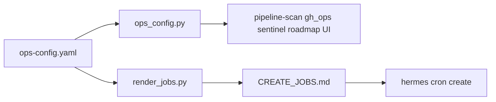

# Hermes Ops Kit — Architecture

This kit is an **ops layer on top of Hermes Agent**. It does not replace Hermes; it adds a shared brain, roadmap UI, audit control plane, and a multi-job daily pipeline.

## Day pipeline

```text
06:00  Brain consolidate
06:15  Sync HERMES_HOME ↔ ~/.hermes mirrors
07:00  Project sentinel (local health → PIPELINES)
08:00  CI scan (+ autofix agent if wakeAgent)   …also 12/16/20
09:30  Product manager (roadmap classify)
10:00  Roadmap executor                         …also 14:00
*/15   Human queue watch (Telegram backoff; quiet weekends)
*/30   PR monitor (merge-on-green; APPROVAL weekdays)
*/10   Audit ingest (backfill agent outputs)
*/5    Roadmap UI watchdog (:8888)
18:00  Market research → MARKET / BUYERS
21:00  Daily ops review + Telegram day report
```

## Control planes

| Plane | SoT | Purpose |
|-------|-----|---------|
| Brain | `$HERMES_HOME/brain/*.md` | Product intent, market, decisions, quality bars |
| Roadmap | `~/.hermes/roadmaps.json` | Agent vs human work queue + HITL steps |
| Audit | `brain/AUDIT.jsonl` | What ran, what blocked, PR/repo links |
| Cron | `$HERMES_HOME/cron/jobs.json` | Schedules, models, prompts (live; not shipped) |
| Config | `ops-config.yaml` | Org, repos, timezone, models, local checks |

## Job kinds

- **Script / `no_agent`:** stdout delivered when non-empty (silent = empty). Examples: sentinel, PR monitor, UI watchdog, audit ingest.
- **Script + agent:** script prints context / `{"wakeAgent": true|false}`; agent runs only when needed (CI autofix) or always (daily digest).
- **Agent:** LLM with skills; final response must be exactly `[SILENT]` unless HITL, failure, or daily report.

## Sparse Telegram

Deliver only:

1. Failures / needs attention
2. Human ACTION / APPROVAL packets (weekdays)
3. Daily ops report (`f6ops2100`)

Everything else → audit + UI.

## Merge policy

| Labels | Checks | Behavior |
|--------|--------|----------|
| `hermes-exec` or `hermes-autofix` | green | Auto-merge squash |
| + `hermes-needs-approval` | green | Hold; APPROVAL Telegram (weekdays) |
| either | red | Telegram RED; no merge |

Prefer `HERMES_GH_TOKEN` bot identity (see `GITHUB_SERVICE_ACCOUNT.md`).

## Config → runtime


